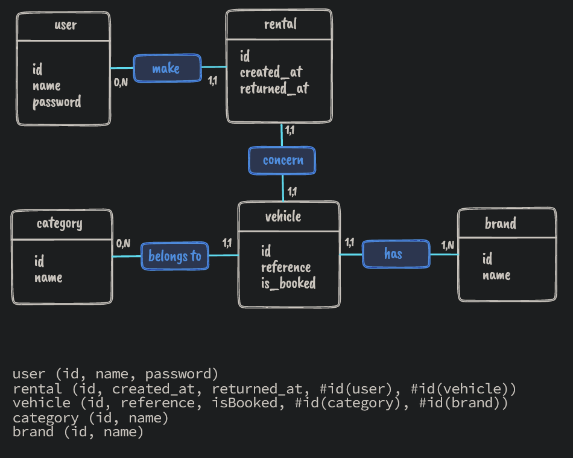
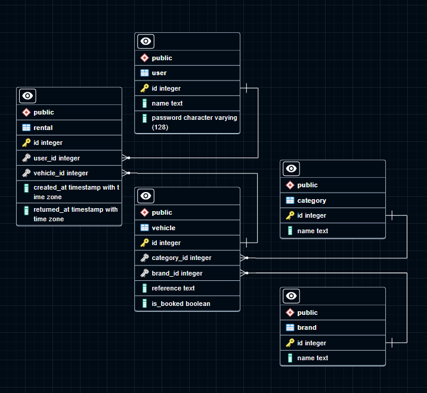

# API Rentolio

## About the API

The basic instructions are the followings :

- Rent a vehicle
- Start and end date
- Check if the vehicle is already rent or not
- Can update or delete the rental
- Cannot rent a vehicle concurrently
- Can test the code

No frameworks imposed, so technologies used are :
- Node JS
- Express JS
- TypeScript JS superset
- Jest & Supertest for testing the code
- Dotenv for environment variables
- Helmet for API protection
- Eslint for linter
- PostgreSQL for DBSM


Versions used for this API:

- For NodeJS 19.2.0
- For PostgreSQL 15.0

Testing the API with : 
- Insomnia
- VS Code extension REST Client

---

## Get started

Steps to follow :

### ➡️ Clone the repository

### ➡️ Configure your environment variables : you'll find all variables needed on the file `.env.example`

The API works with a DBMS Postgresql

### ➡️ Download Postgresql for your OS on official documentation here :

https://www.postgresql.org/download

### ➡️ Create your database, all functions and triggers needed with the data folder :

- You can use Makefile file for migration and seed the database with :

```sh
make alldata
```


- Or if you don't you can play the following commands (**make sure you have the correct port and the correct path**) :

For Windows

```
    psql -U postgres -p 5433 -f ./path/to/data/migration.sql
    psql -U postgres -p 5433 -f ./path/to/data/seed.sql
```

For Linux

```
sudo -iu postgres psql -p 5434 -f /path/to/data/migration.sql

sudo -iu postgres psql -p 5434 -f /path/to/data/migration.sql
```

### ➡️ Install all the dependencies

```sh
npm install
```

### ➡️ Run in development mode

```
npm run dev
```

### ➡️ Run in production mode

```
npm start
```


---

## Endpoints

You'll find here all of the endpoints for the application.

## /API/V1/--

### <u>User</u>

| Method | Route           | Description         | Returns     |
| ------ | --------------- | ------------------- | ----------- |
| GET    | --/users        | Fetch all users     | json object |
| POST   | --/users/signin | User authentication | json object |

## <u>Rentals</u>

| Method | Route                | Description       | Returns              |
| ------ | -------------------- | ----------------- | -------------------- |
| GET    | --/rentals           | Fetch all rentals | json object          |
| POST   | --/rentals           | Register a rental | json object(message) |
| PATCH  | --/rentals/:rentalId | Update a rental   | json object(message) |
| DELETE | --/rentals/:rentalId | Delete a rental   | json object(message) |

### <u>Vehicle</u>

| Method | Route       | Description        | Returns     |
| ------ | ----------- | ------------------ | ----------- |
| GET    | --/vehicles | Fetch all vehicles | json object |

---

## Specifications

The API takes about 2 hours (a little more) for being developed.
Consider that user have to authenticate for making a rental, update or delete his rental.
If a vehicle is not rent, a user can make multiple rentals.

To construct the short project, I use Merise method and Data models to create the base with Conceptual Data Model, Logical Data Model and Physical Data Model.

### CDM & LDM



### PDM



## Future

This project can be improved by implementing more options, like a counting for vehicles for making some statistics.
We can also archive rentals for statistics, add more options on the rental, have an admin status that handle all rentals etc .. 