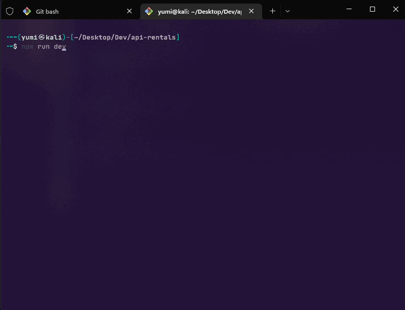

# API Rentolio

## About the API

## Get started

Steps to follow :

### ➡️ Clone the repository

### ➡️ Configure your environment variables : you'll find all variables needed on the file `.env.example`

The API works with a DBMS Postgresql

### ➡️ Download Postgresql for your OS on official documentation here :

https://www.postgresql.org/download

### ➡️ Create your database, all functions and triggers needed with the data folder :

- You can use Makefile file for migration and seed the database with :

```sh
make alldata
```


- Or if you don't you can play the following commands (**make sure you have the correct port and the correct path**) :

For Windows

```
    psql -U postgres -p 5433 -f ./path/to/data/migration.sql
    psql -U postgres -p 5433 -f ./path/to/data/seed.sql
```

For Linux

```
sudo -iu postgres psql -p 5434 -f /path/to/data/migration.sql

sudo -iu postgres psql -p 5434 -f /path/to/data/migration.sql
```

### ➡️ Install all the dependencies

```sh
npm install
```

### ➡️ Run in development mode

```
npm run dev
```

### ➡️ Run in production mode

```
npm start
```


